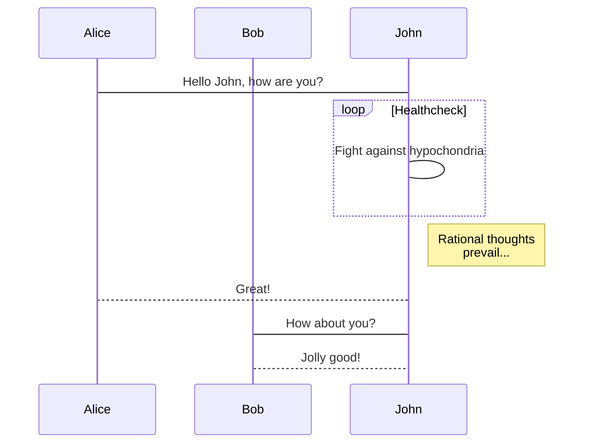

# media-production
A project management tool for media productions.

## Contents :+1:
[User Story](https://github.com/FSConsulting/media-production/Docs/index.html)

## Graphics
I'm heavily interested in graphics. Flowcharts, Sequence, Gantt, and Class diagrams.

  

