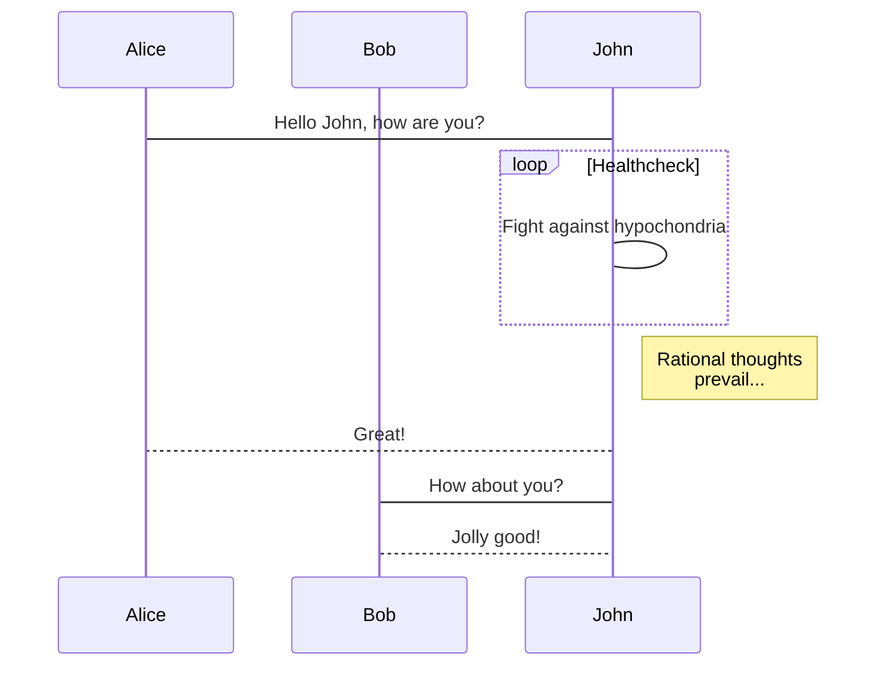

# media-production
A project management tool for media productions.

## Graphics
I'm heavily interested in graphics. Flowcharts, Sequence, Gantt, and Class diagrams could be coded via mermaid driver:

  

